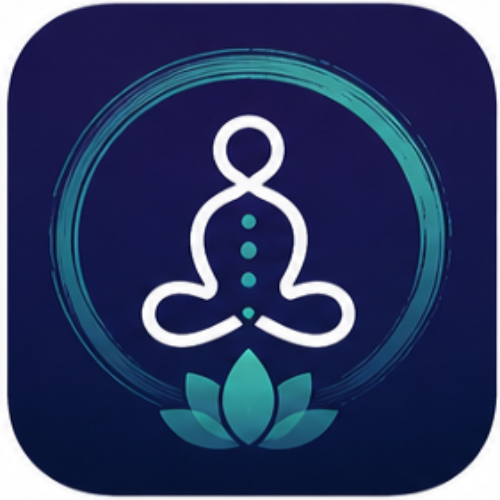
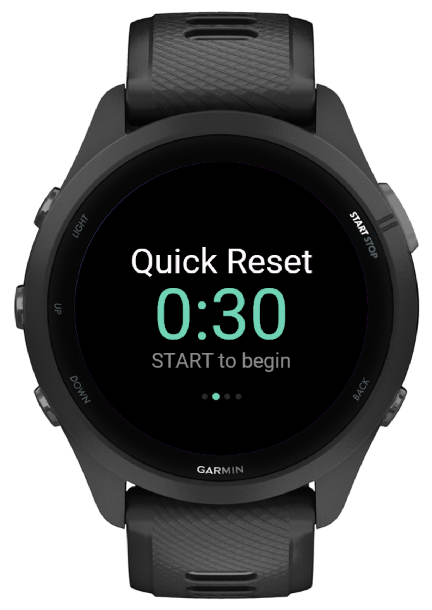
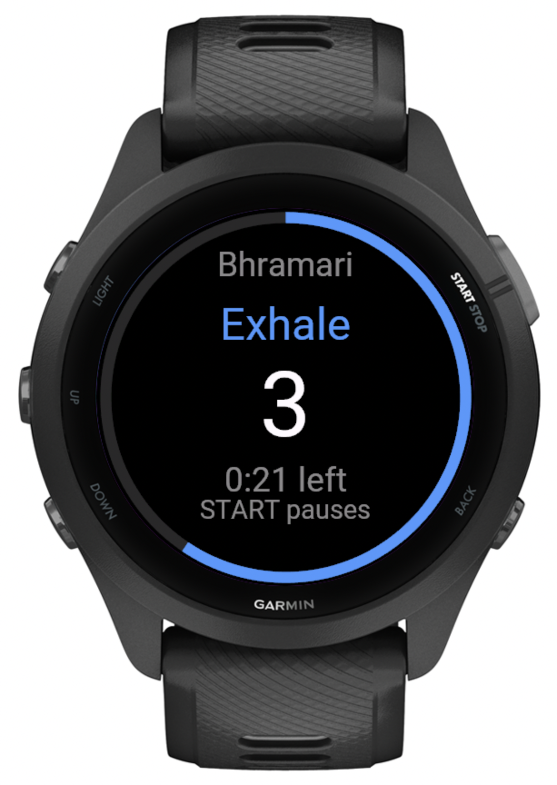
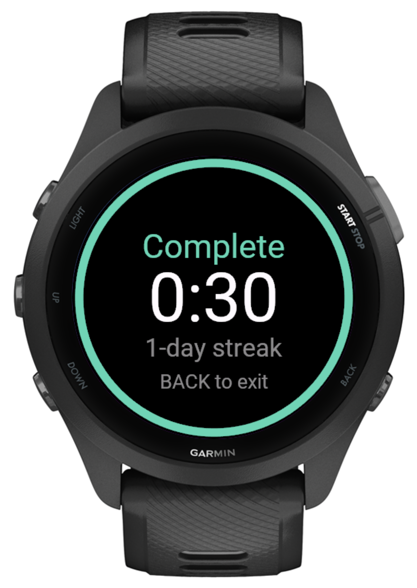
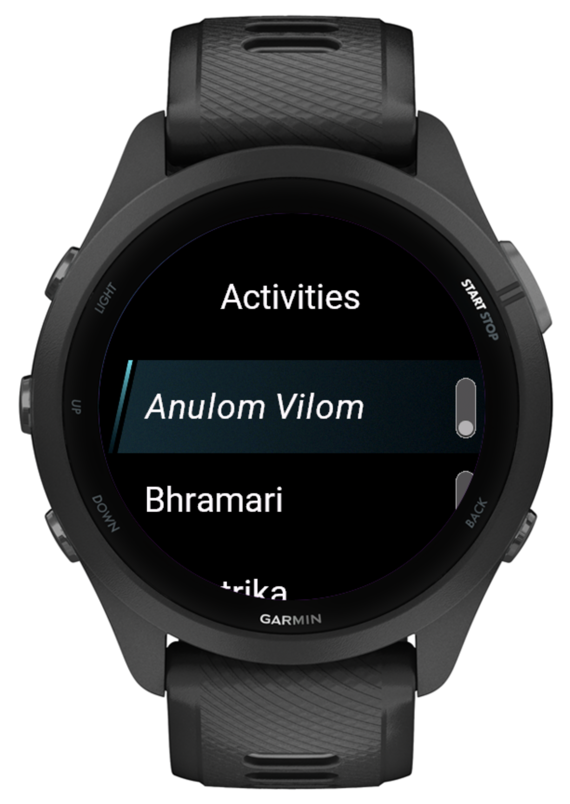
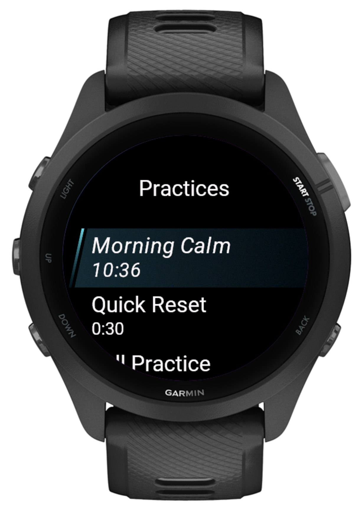

<div align="center">



# Pranayama

**Repeatable breathwork and meditation, built for the wrist.**

A fully offline Garmin Connect IQ app for the Forerunner 265. Build your own pranayama practices, then run them eyes-closed with a breath-paced ring and a distinct vibration for every phase.

</div>

---

## Why

Most breathing apps decide the practice for you. This one doesn't. You compose a session from classical pranayama techniques — set the breath lengths and repetitions you actually use — save it, and start it the next morning with a single button press. No phone, no network, no subscription.

## Screens

<div align="center">

| Quick-start home | Running a practice | Complete |
|:---:|:---:|:---:|
|  |  |  |
| Your last practice, one press from starting. UP/DOWN switches practices. | The ring fills as you inhale, holds, and drains as you exhale — colour-coded per phase. | Duration, streak, and a Breathwork activity saved to Garmin Connect. |

| Choose activities | Manage practices |
|:---:|:---:|
|  |  |
| Pick from five techniques, order them, tune each one. | Edit, add, or delete — reachable without a MENU button. |

</div>

## Features

- **One press to practice** — the home screen is a quick-start carousel showing your last-used session. START begins it; UP/DOWN moves between practices; a trailing "Manage" card handles create / edit / delete. Everything works with UP / DOWN / START / BACK — the FR265 has no MENU button and the app never assumes one.
- **Five techniques** — Anulom Vilom (alternate-nostril, classical 1:4:2 ratio with alternating-side cues), Bhramari, Bhastrika, Kapalbhati, and silent Meditation.
- **Eyes-closed haptic language** — one short pulse to inhale, two quick pulses to hold, one long pulse to exhale, silence to rest. You never need to look at the screen.
- **Breath-paced ring** — fills on the inhale, holds full, drains on the exhale; timed activities count down. Colour changes with the phase.
- **Gentle bookends** — a five-second "settle in" before the first breath; START pauses mid-session; BACK asks before ending so a long sit is never lost by accident.
- **Garmin Connect sync** — completed sessions are saved as Breathwork activities with heart rate. Anything ended under a minute is discarded, so false starts don't clutter your feed.
- **Streaks** — practice history lives on the watch; your current streak shows on completion.
- **Starter presets** — first launch seeds *Morning Calm* and *Quick Reset* so there's a practice ready immediately.

## Architecture

| File | Responsibility |
|---|---|
| [source/App.mc](source/App.mc) | App lifecycle, preset seeding, entry view |
| [source/Home.mc](source/Home.mc) | Quick-start carousel + management menu |
| [source/SessionMenu.mc](source/SessionMenu.mc) | Per-session actions: Start / Edit / Delete (with confirmation) |
| [source/Builder.mc](source/Builder.mc) | Three-step builder: select activities → order → configure |
| [source/NumberPicker.mc](source/NumberPicker.mc) | Full-screen value spinner (UP/DOWN adjust, START save) |
| [source/Runner.mc](source/Runner.mc) | Playback: ms-accurate timing, breath-paced ring, pause, FIT recording |
| [source/History.mc](source/History.mc) | Practice log and streak calculation |
| [source/SessionMath.mc](source/SessionMath.mc) | Durations, defaults, field specs, normalization |
| [source/SessionStore.mc](source/SessionStore.mc) | Persistence, last-session tracking, starter presets |
| [source/Vibes.mc](source/Vibes.mc) | Haptic language (per-phase vibration patterns) |
| [source/Constants.mc](source/Constants.mc) | Activity types, storage keys, colours |

Breath ratios follow the classical 1:4:2 pattern for Anulom Vilom (inhale : hold : exhale), derived from the configured inhale length.

## Build & run

Requires the [Garmin Connect IQ SDK](https://developer.garmin.com/connect-iq/sdk/) and a Java 17 runtime. The helper scripts call the SDK's Java entrypoints directly, so no shell-wrapper setup is needed:

```sh
./scripts/build.sh                 # compile to bin/pranayama.prg
./scripts/run-sim.sh               # load into the Connect IQ simulator (launch it first)
./scripts/package.sh               # build the signed .iq store package
```

Override SDK / Java locations with the `CIQ_SDK_BIN` and `JAVA_BIN` environment variables.

The developer signing key (`developer_key`) is intentionally untracked. Generate your own with the Connect IQ SDK if you fork this — **and back it up**, since every future store update must be signed with the same key.

## Store listing

Marketing copy, descriptions, and asset notes for the Connect IQ Store submission live in [docs/store-listing.md](docs/store-listing.md).

## References

See [docs/garmin-official-references.md](docs/garmin-official-references.md) for the Garmin API documentation used for lifecycle, storage, views, input, timers, vibration, activity recording, and Forerunner 265 targeting.

## License

[MIT](LICENSE) © Reetesh Nimje
